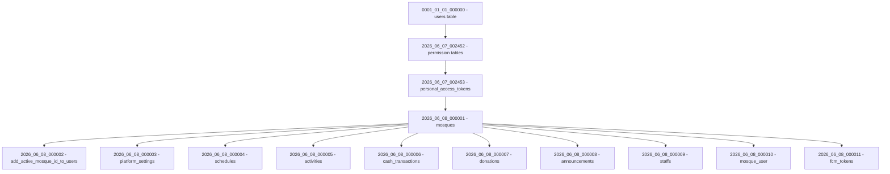

# Design Document: Day 2 Project Setup - Database

## Overview

This design covers the complete database foundation for the EMasjid platform: folder structure scaffolding, Laravel migration files, and PHP Enum classes. The implementation establishes the layered architecture defined in AGENTS.md and creates all domain tables required for mosque management, finance, donations, schedules, activities, announcements, staffs, and congregation membership.

The Laravel project lives at `web/` within the monorepo. All paths in this document are relative to `web/` unless explicitly stated otherwise.

### Key Design Decisions

1. **Migration ordering via timestamp prefix** — Migrations use date-based filenames (`2026_06_08_XXXXXX_`) to guarantee execution order. The mosques table must precede all mosque-scoped tables, and the users table (already existing) must precede mosques.
2. **Enum as string in DB, PHP backed enum in code** — Status/type columns use `string` type in MySQL for flexibility, while PHP 8.1+ backed enums provide type safety at the application layer.
3. **Money as unsigned big integer** — All monetary values are stored in Rupiah (smallest unit) as `unsignedBigInteger`, avoiding floating-point rounding issues.
4. **Cascade delete for mosque-scoped data** — When a mosque is deleted, all child data cascades. User references use `nullOnDelete()` to preserve data integrity when users are removed.
5. **No Redis/queue dependency** — The design avoids any infrastructure not available on shared hosting.

---

## Architecture

The architecture follows a strict layered pattern as defined in AGENTS.md:

```
Controller → Service → Repository → Model
```

This Day 2 setup establishes the physical folder structure and data layer (migrations + enums) that all subsequent feature development builds upon.

### Folder Structure

```
web/app/
├── Contracts/
│   └── Repositories/        # Repository interfaces
├── DataTransferObjects/     # DTOs for service input
├── Enums/                   # PHP 8.1+ backed enums
├── Http/
│   ├── Controllers/
│   │   ├── Admin/           # Admin panel controllers
│   │   ├── Api/             # REST API controllers
│   │   └── Owner/           # Owner panel controllers
│   ├── Requests/
│   │   ├── Admin/           # Admin form requests
│   │   ├── Api/             # API form requests
│   │   └── Owner/           # Owner form requests
│   └── Resources/           # API Resources (JSON transformation)
├── Models/                  # Eloquent models (already exists)
├── Providers/               # Service providers (already exists)
├── Repositories/            # Repository implementations
├── Services/                # Business logic services
└── Traits/                  # Reusable traits (e.g., BelongsToMosque)
```

### Migration Execution Flow



The `mosques` table must be created first (after existing users/permissions migrations) because all mosque-scoped tables reference it via foreign key. The `add_active_mosque_id_to_users` migration runs second because it references `mosques.id`.

---

## Components and Interfaces

### 1. Folder Scaffolder

The folder scaffolder creates 13 directories with `.gitkeep` files. Implementation approach:

- Use a dedicated Artisan command or a simple PHP script invoked via `php artisan`
- Alternatively, since this is a one-time setup, the directories and `.gitkeep` files can be created directly and committed to version control
- The recommended approach is **direct creation and commit** since these are static structural files, not generated runtime artifacts

**Directories to create:**

| # | Path | Purpose |
|---|------|---------|
| 1 | `app/Http/Controllers/Owner` | Owner panel controllers |
| 2 | `app/Http/Controllers/Admin` | Admin panel controllers |
| 3 | `app/Http/Controllers/Api` | API controllers |
| 4 | `app/Services` | Business logic |
| 5 | `app/Repositories` | Repository implementations |
| 6 | `app/Contracts/Repositories` | Repository interfaces |
| 7 | `app/DataTransferObjects` | DTOs |
| 8 | `app/Enums` | Domain enums |
| 9 | `app/Traits` | Shared traits |
| 10 | `app/Http/Requests/Owner` | Owner form requests |
| 11 | `app/Http/Requests/Admin` | Admin form requests |
| 12 | `app/Http/Requests/Api` | API form requests |
| 13 | `app/Http/Resources` | API Resources |

Each directory gets a `.gitkeep` file so Git tracks empty folders.

### 2. Migration Files

Each migration is a standalone anonymous class extending `Illuminate\Database\Migrations\Migration`. They follow Laravel's standard pattern with `up()` and `down()` methods.

**Naming convention:** `{date}_{sequence}_create_{table}_table.php` or `{date}_{sequence}_add_{column}_to_{table}_table.php`

### 3. Enum Classes

Six enum classes in `app/Enums/`, each implementing PHP 8.1+ backed enum with `string` backing type. Every enum includes a `labels()` method returning human-readable labels for UI display.

---

## Data Models

### Migration File Listing

| # | Filename | Table | Type |
|---|----------|-------|------|
| 1 | `2026_06_08_000001_create_mosques_table.php` | mosques | Platform |
| 2 | `2026_06_08_000002_add_active_mosque_id_to_users_table.php` | users (alter) | Platform |
| 3 | `2026_06_08_000003_create_platform_settings_table.php` | platform_settings | Platform |
| 4 | `2026_06_08_000004_create_schedules_table.php` | schedules | Mosque-scoped |
| 5 | `2026_06_08_000005_create_activities_table.php` | activities | Mosque-scoped |
| 6 | `2026_06_08_000006_create_cash_transactions_table.php` | cash_transactions | Mosque-scoped |
| 7 | `2026_06_08_000007_create_donations_table.php` | donations | Mosque-scoped |
| 8 | `2026_06_08_000008_create_announcements_table.php` | announcements | Mosque-scoped |
| 9 | `2026_06_08_000009_create_staffs_table.php` | staffs | Mosque-scoped |
| 10 | `2026_06_08_000010_create_mosque_user_table.php` | mosque_user | Pivot |
| 11 | `2026_06_08_000011_create_fcm_tokens_table.php` | fcm_tokens | Platform |

### Table Schemas

#### `mosques`

```php
Schema::create('mosques', function (Blueprint $table) {
    $table->id();
    $table->string('name', 255);
    $table->string('slug', 255)->unique();
    $table->text('address');
    $table->string('city', 100);
    $table->string('province', 100);
    $table->string('postal_code', 10)->nullable();
    $table->string('phone', 20)->nullable();
    $table->string('email', 255)->nullable();
    $table->text('description')->nullable();
    $table->string('photo', 255)->nullable();
    $table->decimal('latitude', 10, 7)->nullable();
    $table->decimal('longitude', 10, 7)->nullable();
    $table->string('bank_name', 100)->nullable();
    $table->string('bank_account_name', 255)->nullable();
    $table->string('bank_account_number', 50)->nullable();
    $table->string('qris_image', 255)->nullable();
    $table->string('invitation_code', 20)->unique();
    $table->string('status', 20)->default('pending');
    $table->foreignId('admin_user_id')->constrained('users');
    $table->text('rejection_reason')->nullable();
    $table->timestamp('approved_at')->nullable();
    $table->timestamps();
    $table->softDeletes();

    $table->index('status');
    $table->index('city');
    $table->index(['latitude', 'longitude']);
});
```

#### `users` (alter — add active_mosque_id)

```php
Schema::table('users', function (Blueprint $table) {
    $table->unsignedBigInteger('active_mosque_id')->nullable()->after('remember_token');
    $table->foreign('active_mosque_id')->references('id')->on('mosques')->nullOnDelete();
});
```

#### `platform_settings`

```php
Schema::create('platform_settings', function (Blueprint $table) {
    $table->id();
    $table->string('key', 100)->unique();
    $table->text('value');
    $table->string('description', 255)->nullable();
    $table->timestamps();
});
```

#### `schedules`

```php
Schema::create('schedules', function (Blueprint $table) {
    $table->id();
    $table->foreignId('mosque_id')->constrained()->cascadeOnDelete();
    $table->date('date');
    $table->time('subuh');
    $table->time('subuh_iqomah')->nullable();
    $table->time('dzuhur');
    $table->time('dzuhur_iqomah')->nullable();
    $table->time('ashar');
    $table->time('ashar_iqomah')->nullable();
    $table->time('maghrib');
    $table->time('maghrib_iqomah')->nullable();
    $table->time('isya');
    $table->time('isya_iqomah')->nullable();
    $table->time('jumat_time')->nullable();
    $table->string('jumat_khatib', 255)->nullable();
    $table->string('jumat_imam', 255)->nullable();
    $table->timestamps();

    $table->index(['mosque_id', 'date']);
});
```

#### `activities`

```php
Schema::create('activities', function (Blueprint $table) {
    $table->id();
    $table->foreignId('mosque_id')->constrained()->cascadeOnDelete();
    $table->string('title', 255);
    $table->text('description')->nullable();
    $table->string('speaker', 255)->nullable();
    $table->string('location', 255)->nullable();
    $table->date('start_date');
    $table->time('start_time')->nullable();
    $table->time('end_time')->nullable();
    $table->boolean('is_recurring')->default(false);
    $table->string('recurrence_note', 255)->nullable();
    $table->string('status', 20)->default('upcoming');
    $table->timestamps();

    $table->index(['mosque_id', 'status', 'start_date']);
});
```

#### `cash_transactions`

```php
Schema::create('cash_transactions', function (Blueprint $table) {
    $table->id();
    $table->foreignId('mosque_id')->constrained()->cascadeOnDelete();
    $table->string('type', 20);
    $table->unsignedBigInteger('amount');
    $table->string('description', 255);
    $table->string('category', 100)->nullable();
    $table->date('transaction_date');
    $table->text('notes')->nullable();
    $table->foreignId('recorded_by')->nullable()->constrained('users')->nullOnDelete();
    $table->timestamps();

    $table->index(['mosque_id', 'type', 'transaction_date']);
    $table->index(['mosque_id', 'transaction_date']);
});
```

#### `donations`

```php
Schema::create('donations', function (Blueprint $table) {
    $table->id();
    $table->foreignId('mosque_id')->constrained()->cascadeOnDelete();
    $table->foreignId('user_id')->nullable()->constrained('users')->nullOnDelete();
    $table->string('category', 20);
    $table->unsignedBigInteger('amount');
    $table->unsignedBigInteger('fee_amount');
    $table->unsignedBigInteger('payment_amount');
    $table->unsignedBigInteger('mosque_receives');
    $table->string('fee_mechanism', 30);
    $table->string('status', 20)->default('pending');
    $table->boolean('is_anonymous')->default(false);
    $table->string('merchant_order_id', 50)->unique();
    $table->text('payment_url')->nullable();
    $table->string('reference', 100)->nullable();
    $table->string('payment_method', 50)->nullable();
    $table->timestamp('confirmed_at')->nullable();
    $table->timestamp('expired_at')->nullable();
    $table->text('notes')->nullable();
    $table->timestamps();

    $table->index(['mosque_id', 'status']);
    $table->index(['user_id', 'status']);
});
```

#### `announcements`

```php
Schema::create('announcements', function (Blueprint $table) {
    $table->id();
    $table->foreignId('mosque_id')->constrained()->cascadeOnDelete();
    $table->string('title', 255);
    $table->text('content');
    $table->string('image', 255)->nullable();
    $table->string('status', 20)->default('draft');
    $table->timestamp('published_at')->nullable();
    $table->foreignId('published_by')->nullable()->constrained('users')->nullOnDelete();
    $table->timestamps();

    $table->index(['mosque_id', 'status', 'published_at']);
});
```

#### `staffs`

```php
Schema::create('staffs', function (Blueprint $table) {
    $table->id();
    $table->foreignId('mosque_id')->constrained()->cascadeOnDelete();
    $table->foreignId('user_id')->constrained()->cascadeOnDelete();
    $table->string('position', 100);
    $table->boolean('is_active')->default(true);
    $table->date('joined_at')->nullable();
    $table->timestamps();

    $table->unique(['mosque_id', 'user_id']);
});
```

#### `mosque_user`

```php
Schema::create('mosque_user', function (Blueprint $table) {
    $table->id();
    $table->foreignId('mosque_id')->constrained()->cascadeOnDelete();
    $table->foreignId('user_id')->constrained()->cascadeOnDelete();
    $table->timestamp('joined_at')->nullable();
    $table->timestamps();

    $table->unique(['mosque_id', 'user_id']);
});
```

#### `fcm_tokens`

```php
Schema::create('fcm_tokens', function (Blueprint $table) {
    $table->id();
    $table->foreignId('user_id')->constrained()->cascadeOnDelete();
    $table->text('token');
    $table->string('device_type', 20);
    $table->timestamps();

    $table->index('user_id');
    $table->unique(['user_id', 'token']);
});
```

### Enum Classes

All enums reside in `app/Enums/` namespace `App\Enums`.

#### `MosqueStatus`

```php
enum MosqueStatus: string
{
    case Pending = 'pending';
    case Active = 'active';
    case Suspended = 'suspended';
    case Rejected = 'rejected';

    public function labels(): string
    {
        return match ($this) {
            self::Pending => 'Menunggu Persetujuan',
            self::Active => 'Aktif',
            self::Suspended => 'Ditangguhkan',
            self::Rejected => 'Ditolak',
        };
    }
}
```

#### `DonationStatus`

```php
enum DonationStatus: string
{
    case Pending = 'pending';
    case Confirmed = 'confirmed';
    case Failed = 'failed';
    case Expired = 'expired';

    public function labels(): string
    {
        return match ($this) {
            self::Pending => 'Menunggu Pembayaran',
            self::Confirmed => 'Dikonfirmasi',
            self::Failed => 'Gagal',
            self::Expired => 'Kedaluwarsa',
        };
    }
}
```

#### `DonationCategory`

```php
enum DonationCategory: string
{
    case Infaq = 'infaq';
    case Zakat = 'zakat';
    case Sadaqah = 'sadaqah';
    case Waqf = 'waqf';

    public function labels(): string
    {
        return match ($this) {
            self::Infaq => 'Infaq',
            self::Zakat => 'Zakat',
            self::Sadaqah => 'Sedekah',
            self::Waqf => 'Wakaf',
        };
    }
}
```

#### `TransactionType`

```php
enum TransactionType: string
{
    case Income = 'income';
    case Expense = 'expense';

    public function labels(): string
    {
        return match ($this) {
            self::Income => 'Pemasukan',
            self::Expense => 'Pengeluaran',
        };
    }
}
```

#### `AnnouncementStatus`

```php
enum AnnouncementStatus: string
{
    case Draft = 'draft';
    case Published = 'published';
    case Archived = 'archived';

    public function labels(): string
    {
        return match ($this) {
            self::Draft => 'Draf',
            self::Published => 'Dipublikasikan',
            self::Archived => 'Diarsipkan',
        };
    }
}
```

#### `ActivityStatus`

```php
enum ActivityStatus: string
{
    case Upcoming = 'upcoming';
    case Ongoing = 'ongoing';
    case Completed = 'completed';
    case Cancelled = 'cancelled';

    public function labels(): string
    {
        return match ($this) {
            self::Upcoming => 'Akan Datang',
            self::Ongoing => 'Sedang Berlangsung',
            self::Completed => 'Selesai',
            self::Cancelled => 'Dibatalkan',
        };
    }
}
```

### Index Strategy

Indexes are designed around expected query patterns:

| Table | Index | Query Pattern |
|-------|-------|---------------|
| mosques | `status` | Owner panel: filter mosques by status |
| mosques | `city` | API: search mosques by city |
| mosques | `[latitude, longitude]` | API: nearby mosque search |
| schedules | `[mosque_id, date]` | Admin/API: lookup schedule by mosque + date |
| activities | `[mosque_id, status, start_date]` | Admin/API: upcoming activities for a mosque |
| cash_transactions | `[mosque_id, type, transaction_date]` | Admin: filter transactions by type and date |
| cash_transactions | `[mosque_id, transaction_date]` | Admin: all transactions for date range |
| donations | `[mosque_id, status]` | Admin: donations by status |
| donations | `[user_id, status]` | API: user's donation history |
| announcements | `[mosque_id, status, published_at]` | Admin/API: published announcements list |
| staffs | `unique [mosque_id, user_id]` | Prevent duplicate staff per mosque |
| mosque_user | `unique [mosque_id, user_id]` | Prevent duplicate membership |
| fcm_tokens | `user_id` | Lookup tokens by user for push notifications |
| fcm_tokens | `unique [user_id, token]` | Prevent duplicate token registration |

### Foreign Key Constraints and Cascade Rules

| Source | Column | References | On Delete |
|--------|--------|------------|-----------|
| mosques | admin_user_id | users.id | RESTRICT (constrained) |
| users | active_mosque_id | mosques.id | SET NULL |
| schedules | mosque_id | mosques.id | CASCADE |
| activities | mosque_id | mosques.id | CASCADE |
| cash_transactions | mosque_id | mosques.id | CASCADE |
| cash_transactions | recorded_by | users.id | SET NULL |
| donations | mosque_id | mosques.id | CASCADE |
| donations | user_id | users.id | SET NULL |
| announcements | mosque_id | mosques.id | CASCADE |
| announcements | published_by | users.id | SET NULL |
| staffs | mosque_id | mosques.id | CASCADE |
| staffs | user_id | users.id | CASCADE |
| mosque_user | mosque_id | mosques.id | CASCADE |
| mosque_user | user_id | users.id | CASCADE |
| fcm_tokens | user_id | users.id | CASCADE |

**Rationale:**
- Mosque-scoped data cascades on mosque deletion (mosque is the parent tenant entity)
- User references in "recorded_by" / "published_by" columns use SET NULL to preserve transaction/announcement records when a user is deleted
- Staffs and mosque_user cascade on user deletion since membership records lose meaning without the user
- `mosques.admin_user_id` uses RESTRICT (default `constrained()`) to prevent deleting a user who is the admin of a mosque — the admin must be reassigned first

---

## Error Handling

### Migration Errors

| Scenario | Handling |
|----------|----------|
| Foreign key reference to non-existent table | Migration fails with integrity error. Ordering ensures this doesn't happen. |
| Duplicate migration execution | Laravel's migration tracker (`migrations` table) prevents re-running. |
| Failed migration mid-batch | Laravel rolls back the entire batch on failure (MySQL InnoDB). |
| Rollback with dependent tables | `down()` methods drop tables in reverse order. Cascade constraints handle FK cleanup. |

### Enum Edge Cases

| Scenario | Handling |
|----------|----------|
| Database value not matching enum case | Model casting will throw `ValueError`. Application should validate input before storage. |
| New enum value added later | Add new case to enum, create migration to update default/constraint if needed. |

### Folder Scaffolding

| Scenario | Handling |
|----------|----------|
| Directory already exists | Skip without error (idempotent operation). |
| Permission denied | Report error with specific directory path. |

---

## Testing Strategy

Property-based testing is **not applicable** for this feature. The work consists of:
- Declarative database schema definitions (migrations)
- Static enum class definitions
- One-time folder scaffolding

These are all infrastructure setup tasks with no meaningful input variation to test across. The appropriate testing strategies are:

### Unit Tests

1. **Enum tests** — Verify each enum class:
   - Has the correct cases and backing values
   - `labels()` returns non-empty strings for all cases
   - Can be instantiated from string values via `::from()`
   - `::tryFrom()` returns null for invalid values

2. **Migration schema tests** — Use Laravel's schema assertions:
   - Each migration creates/modifies the expected table
   - Required columns exist with correct types
   - Indexes and unique constraints are in place
   - Foreign keys reference correct tables

### Integration Tests

1. **Full migration run** — `php artisan migrate` completes without errors on a fresh database
2. **Full rollback** — `php artisan migrate:rollback` reverses cleanly
3. **Fresh migration** — `php artisan migrate:fresh` drops and recreates everything
4. **Foreign key integrity** — Inserting records with invalid FK references fails with expected constraint errors

### Smoke Tests

1. **Folder structure** — All 13 directories exist after setup
2. **`.gitkeep` presence** — Empty directories contain `.gitkeep`
3. **PSR-4 autoloading** — Enum classes are autoloadable via `App\Enums\{ClassName}`

### Test Organization

```
tests/
├── Feature/
│   └── Database/
│       ├── MigrationRunTest.php         # Full migrate/rollback/fresh
│       └── SchemaIntegrityTest.php      # FK constraints, indexes
└── Unit/
    └── Enums/
        ├── MosqueStatusTest.php
        ├── DonationStatusTest.php
        ├── DonationCategoryTest.php
        ├── TransactionTypeTest.php
        ├── AnnouncementStatusTest.php
        └── ActivityStatusTest.php
```
